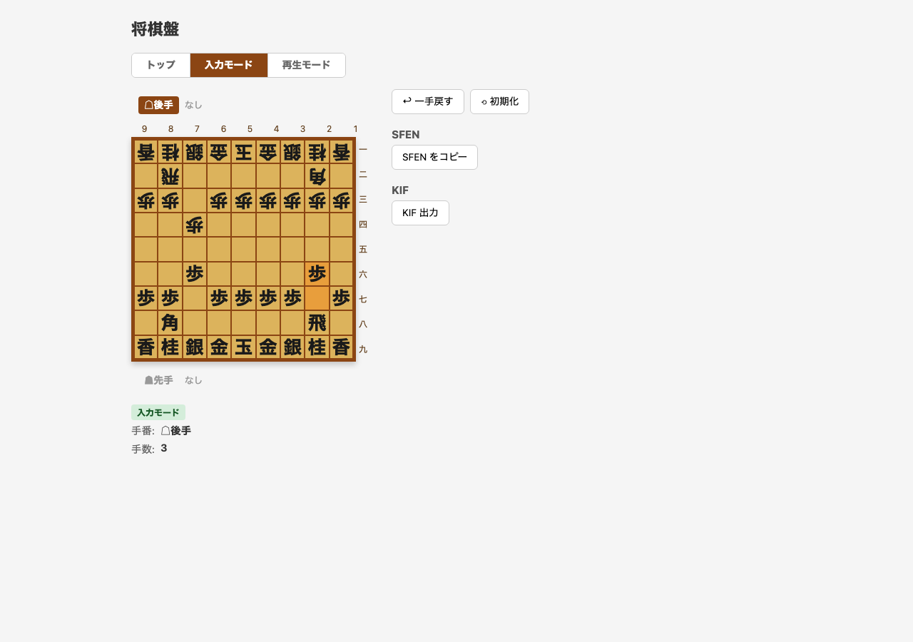
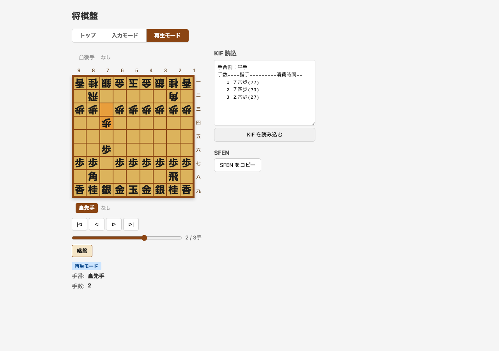

# 将棋盤コンポーネント サンプル

Vue 3 + TypeScript で実装した汎用将棋盤コンポーネントのサンプルアプリケーション。

### 入力モード



### 再生モード



## 機能

- **入力モード** (`/play`): クリック操作で駒を動かして棋譜を作成
- **再生モード** (`/replay`): KIF形式の棋譜を読み込んで前後に送る
- **継盤モード**: 再生中の局面から一時的に駒を動かす

## 技術スタック

- Vue 3 (Composition API)
- TypeScript
- Vite
- Vue Router 4

## セットアップ

```bash
npm install
npm run dev
```

## ドキュメント

詳細な設計書は [`docs/design.md`](docs/design.md) を参照してください。
